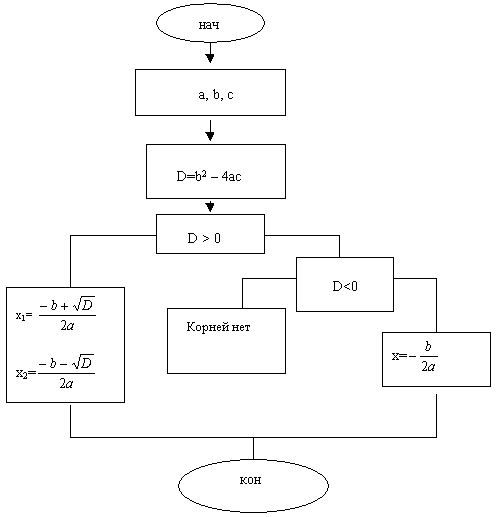

# Quadratic_equation

Программа которая решает квадратное уравнение

## Содержание
[Что такое квадратное уравнение](What_is_it)

[Как решать квадратное уравнение](Solving)

[Установка программы](#Installation)

[Технологии использованные в программе](#Tehn)

[Пример использования](#prim)

[Автор](#avt)

<a name="What_is_it"><h2>Что такое квадратное уравнение</h2></a>


<a name="Solving"><h2>Как решать квадратное уравнение</h2></a>



<a name="Installation"><h2>Установка</h2></a>

1). Склонировать репозиторий git clone

2). Пишем в cmd команду: 
 ```make``` 
 она компилирует программу
 


<a name="Tehn"><h2>Технологии</h2></a>

Python 3.10

PyTelegramBotAPI (TeleBot)

requests

api-ninjas

<a name="prim"><h2>Пример работы</h2></a> 


<a name="avt"><h2>Автор</h2></a>
Овсиекно Глеб