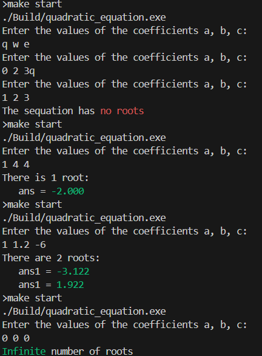
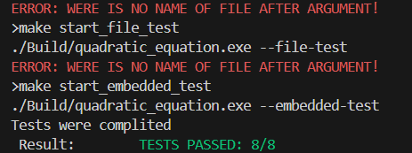
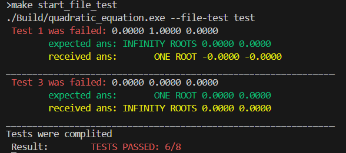

# Quadratic_equation

Программа которая решает квадратное уравнение

## Содержание
[Что такое квадратное уравнение](What_is_it)

[Как решать квадратное уравнение](Solving)

[Установка программы](#Installation)

[Поддерживаемые программой команды](#Commands)

[Технологии использованные в программе](#Technologies)

[Пример использования](#Eexample)

[Автор](#avt)

<a name="What_is_it"><h2>Что такое квадратное уравнение</h2></a>
>Квадратное уравнение представляет собой уравнение второй степени. Его стандартная форма записи — $ax^2 +bx + c = 0$, где a, b и c являются коэффициентами, а x — переменной, которую необходимо определить.


<a name="Solving"><h2>Как решать квадратное уравнение</h2></a>
Решение использованное в программе представлено на фото ниже


<a name="Installation"><h2>Установка программы</h2></a>

1). Склонировать репозиторий git clone

2). Пишем в cmd команду: 
 ```make``` 
 она компилирует программу
 

 <a name="Commands"><h2>Поддерживаемые программой команды</h2></a>

### С помощью [Make](./Makefile)

|Команда                       |Что она делает                            |
|------------------------------|------------------------------------------|
|```make```                    | компилирует программу                    |
|```make start```              | начинает программу в стандартном режимe  |
|```make start_embedded_test```| выполняет тесты прописанные в программе  |
|```make start_file_test ```   | выполняет тесты прописанные в файле test |
|```make clean ```             | удаляут все скомпилированные файлы       |

### Без него

```./Build/quadratic_equation.exe ``` компилирует файл

Кроме того, можно запустить программу с аргументами

|Аргумент                     | Что он делает                                |
|-----------------------------|----------------------------------------------|
|```--embedded-test```        | выполняет тесты прописанные в программе      |
|```--file-test <file_name>```| выполняет тесты прописанные в заданноом файле|


<a name="Technologies"><h2>Технологии использованные в программе</h2></a>

* g++  14.2.0
* cmd Linux

<a name="Example"><h2>Пример работы</h2></a> 

Включая некоторые выаоды ошибок (последние были сгенерированны специально для демонстрации)





<a name="avt"><h2>Автор</h2></a>
Овсиекно Глеб